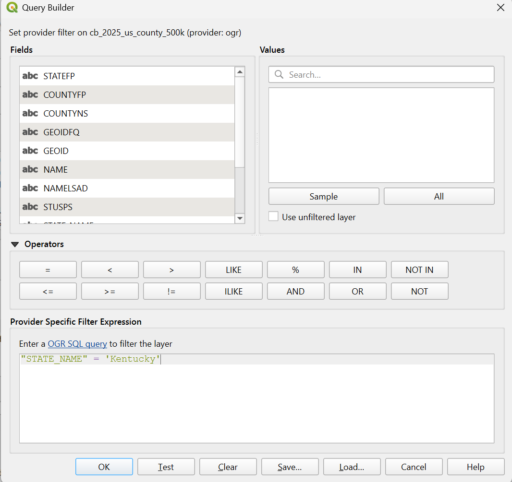
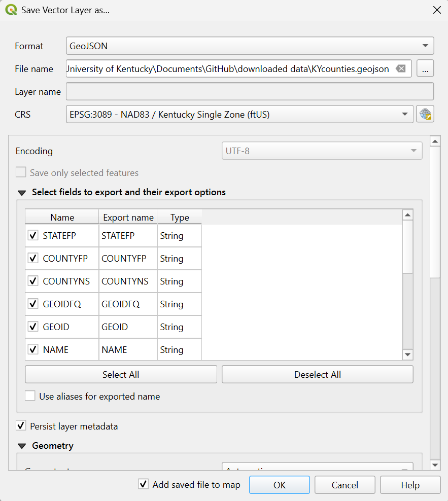
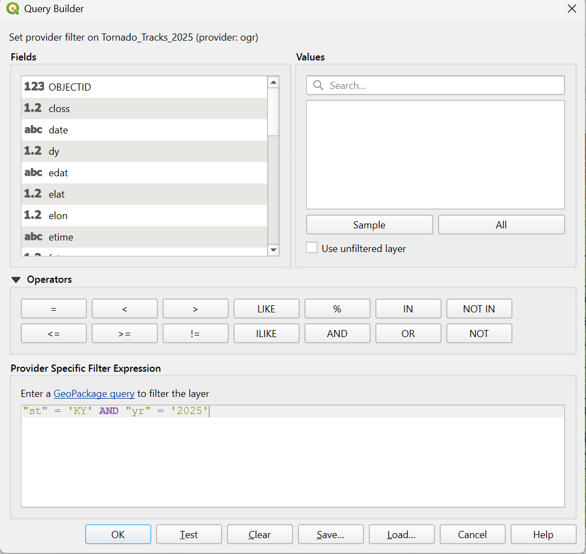
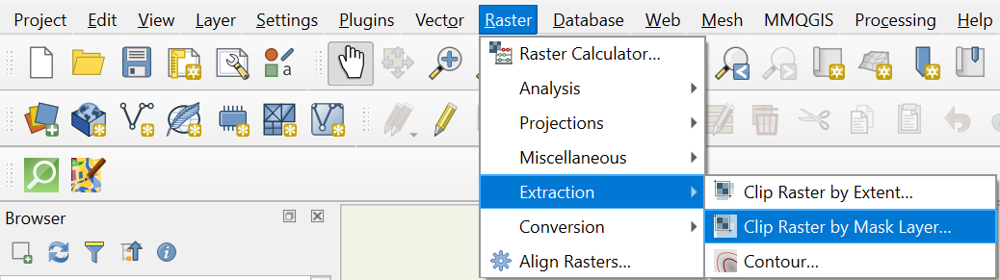
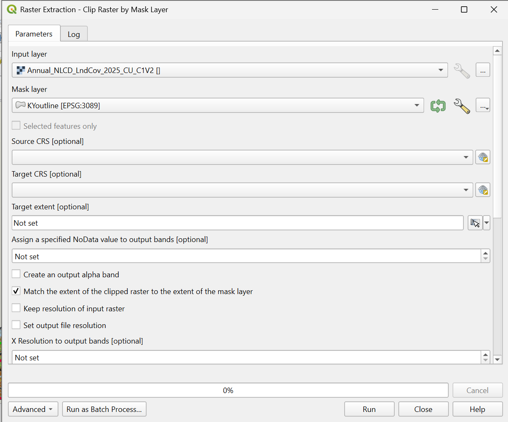
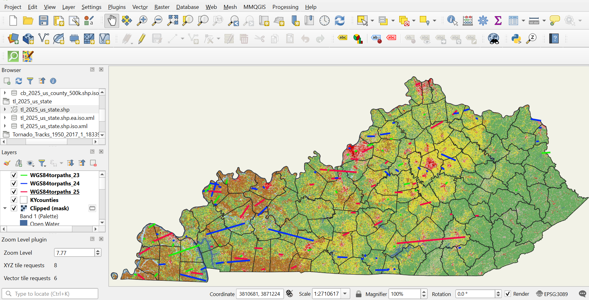

# Kentucky Tornado Paths (2023-2025)

## Project Contents

- [Data Source](#data-source)
- [Project Background](#project-background)
- [Purpose](#purpose)
- [Mapmaking Process](#mapmaking-process)
- [Map summary](#map-summary)
- [Final Project Link](#final-project-link)

***

### Data Source

- **Landcover**
  (https://www.sciencebase.gov/catalog/item/697b9279b66b0197c3043cc3)

  Scroll down to **Attached Files**, click **...show more...**, download *“2025 LndCov data zip”*
  
  
- **Tornado Tracks** 
  (https://resilience-fema.hub.arcgis.com/datasets/e75412d18bdc469dbf89bf7e929475cc/explore?filters=eyJzdCI6WyJLWSJdfQ%3D%3D&location=38.040459%2C-84.617522%2C8&style=dy)

  Find the **Filter Data** button in the blue toolbar on the screen, filter for State Abbreviation Code (KY), click the download button from the same toolbar, download the Geopackage
  

- **County Boundaries**
  (https://www.census.gov/geographies/mapping-files/time-series/geo/cartographic-boundary.html)

  Scroll down to **Counties**, download the shapefile named *1:500,000 (national)*

- **State Boundaries**
  (https://www.census.gov/cgi-bin/geo/shapefiles/index.php?year=2025&layergroup=States+%28and+equivalent%29)

  Download national file
  
  
* Initial Data projection: EPSG:3089 - NAD83/Kentucky Single Zone (ftUS)
  
* Final Map projection: EPSG:3089 - NAD83/Kentucky Single Zone (ftUS)

***

### Project Background

There has been a notable increase in severe weather events across the U.S. I was born and raised in Kentucky and thought it would be interesting to map the tornado paths from 2023-2025. 2026 data was unavailable.

***

### Purpose

The purpose of this map is to display tornado paths throughout the state of Kentucky from 2023-2025. I hope the map will help answer the following questions: Are tornados happening in a common portion of the state? For example, are more happening in the North, South, Central, Eastern, or Western parts of KY? Is there a notable difference in tornado length of path and magnitude over the years? What type of landcover has been most effected?

***

### Mapmaking Process

1. Download the 4 files mentioned in [Data Source](#data-source) (extract any zip files)

2. Open QGIS

3. In the Menu Toolbar, click on **Project > Properties...** change the **CRS** to *EPSG:3089 - NAD83/Kentucky Single Zone (ftUS)* since our area of interest is Kentucky
  
4. In the Browser pane, find the folder where you downloaded the files

5. To add layers to map, double click on: *Annual_NLCD_LndCov_2025_CU_C1V2*, *cb_2025_us_county_500k.shp*, *tl_2025_us_state.shp*, then *Tornado_Tracks_A.shp*

6. Add *Tornado_Tracks_A.shp* 2 more times for a total of 3 tornado shapefiles

7. Right-click on *cb_2025_us_county_500k.shp* and select **Filter**. Filter only KY counties by following screenshot below

8. Right-click on *cb_2025_us_county_500k.shp* again to **Export > Save Feature As...** GeoJSON

   

9. Right-click on *tl_2025_us_state.shp* and select **Filter**. Filter for state name Kentucky and **Export > Save Feature As...** GeoJSON 

10. Right-click on *Tornado_Tracks_A.shp* and select **Filter**. Follow the screenshot below to filter tornado paths for KY by each year (2023, 2024, & 2025), that's why we added duplicate *Tornado_Track_A.shp* layers

11. Right-click on each *Tornado_Track_A.shp* to **Export > Save Feature As...** GeoJSON

12. After county boundaries, state boundaries, and tornado paths have been filtered we will work on getting the NLCD layer clipped to match the outline of Kentucky instead of the entire U.S.

13. In the Menu Toolbar, click on **Raster > Extraction > Clip Raster by Mask Layer...**

15. Hopefully, your NLCD layer clipped to KY boundary as the image above shows. **Export > Save Feature As...** I saved as both a GeoTIFF and GeoPackage just to be safe

16. Ideally, our final product will be a 2-panel map, one of KY Tornado Paths (2023-2025) & one of KY Tornado Paths with Landcover (2023-2025). In order to achieve this, we'll need to first uncheck the clipped NLCD layer to hide it, then right-click on counties and subsequently all 3 tornado paths to go to **Properties > Symbology**

18. 

17. Ensure that KY is taking up a majority of the map extent then go to **Project**, **New Print Layout**

***

### Map summary

**Longest tornado path**
- 2023, July 1 : 27.42 miles, magnitude 1
- 2024, May 26 : 39.99 miles, magnitude 1
- *2025, May 16 : 60.08 miles, magnitude 4*

**Total tornados**
- 2023 : 34
- *2024 : 48*
- 2025: 37

**Tornado location**
- Most tornado activity appears to be in the Western and Central portions of the state. These areas tend to be flatter, whereas you travel east across KY, you get into the Cumberland Plateau region where topography changes becoming hillier and mountainous just before the Appalachian Mountain range. 

**Landcover**
- 

***

## Final Project Link

Here you are linking from the README.md to the index.html.

Please view the [final map online](www.github...)
