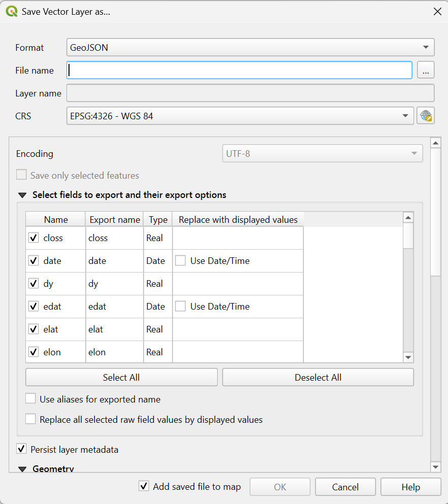

# Kentucky Tornado Paths (2023-2025)

## Project Contents

- [Data Source](#data-source)
- [Project Background](#project-background)
- [Purpose](#purpose)
- [Mapmaking Process](#mapmaking-process)
- [Map summary](#map-summary)
- [Final Project Link](#final-project-link)

***

### Data Source

- 2025 NLCD Landcover
  (https://www.sciencebase.gov/catalog/item/697b9279b66b0197c3043cc3)

  Scroll down to Attached Files, click on ...show more..., download the second to last file named Annual_NLCD_LndCov_2025_CU_C1V2.zip “2025 LndCov data zip”

- Tornado Tracks 
  (https://resilience-fema.hub.arcgis.com/datasets/e75412d18bdc469dbf89bf7e929475cc/explore?filters=eyJzdCI6WyJLWSJdfQ%3D%3D&location=38.040459%2C-84.617522%2C8&style=dy)

  Find the Filter Data button in the blue toolbar on the screen, filter for State Abbreviation Code (KY), click the download button from the same toolbar, download the Geopackage

- County Boundaries
  (https://www.census.gov/geographies/mapping-files/time-series/geo/cartographic-boundary.html)

  Scroll down to Counties, download the shapfile named 1:500,000 (national)

* Initial Data projection: In QGIS, I used EPSG:3089 - NAD83/Kentucky Single Zone (ftUS)
  
* Final Map projection: In Mapbox, I had to use EPSG:4326-WGS 84

### Project Background

In recent decades, there has been a notable increase in severe weather events across the U.S. I was born and raised in Kentucky and thought it would be interesting to map the tornado paths from 2023-2025. 2026 data was unavailable. 

### Purpose

The purpose of this map is to display tornado paths throughout the state of Kentucky from 2023-2025. I hope the map will help answer the following questions: Are tornados happening in a common location in the state? For example, are more happening in the North, South, Central, Eastern, or Western parts of KY? Is there a primary landcover type where these tornados are happening? Is there a notable difference in length of tornado paths over the years?

### Mapmaking Process

1. Download the 3 files mentioned in [Data Source](#data-source) (extract any zip files)

2. Open QGIS

3. Click on **Project > Properties...** change the **CRS** to EPSG:3089 - NAD83/Kentucky Single Zone (ftUS)
  
4. In the Browser pane, find the folder where you downloaded the files

5. To add layers to map, double click on: *Annual_NLCD_LndCov_2025_CU_C1V2.tif*, then *cb_2025_us_county_500k.shp*, then *Tornado_Tracks_A.shp*

6. Add *Tornado_Tracks_A.shp* 2 more times for a total of 3 tornado shapefiles

7. Right-click on *cb_2025_us_county_500k.shp* and select **Filter**. Filter only KY counties by following screenshot below

8. Right-click on *cb_2025_us_county_500k.shp* again to **Export > Save Feature As...**

   

9. Right-click on *Tornado_Tracks_A.shp* and select **Filter**. Follow the screenshot below to filter tornado paths for KY by each year (2023, 2024, & 2025), that's why we added duplicate *Tornado_Track_A.shp*

10. Right-click on each *Tornado_Track_A.shp* to **Export > Save Feature As...** In order to upload the tornado GeoJSON's to Mapbox later, we need to save as EPSG:4326-WGS 84

  

 11. 

### Map summary

**Longest tornado path**
- 2023, July 1 : 27.42 miles, magnitude 1
- 2024, May 26 : 39.99 miles, magnitude 1
- *2025, May 16 : 60.08 miles, magnitude 4*

**Total tornados**
- 2023 : 34
- *2024 : 48*
- 2025: 37

## Final Project Link

Here you are linking from the README.md to the index.html.

Please view the [final map online](www.github...)
